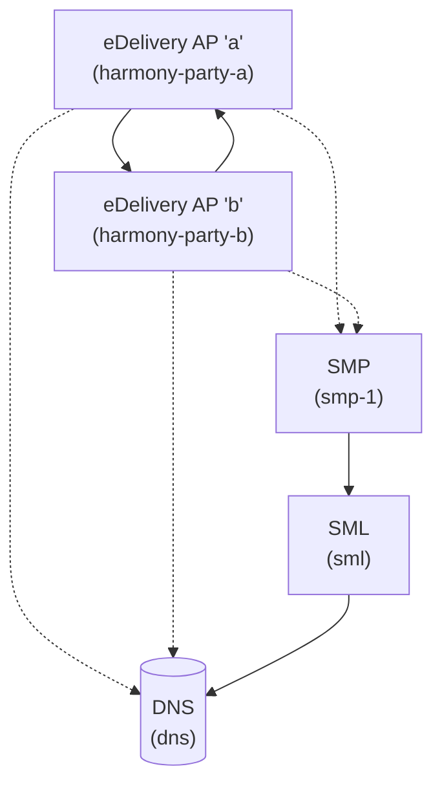

# Proto for eDelivery Dynamic Discover Setup

<!-- TOC -->
* [Proto for eDelivery Dynamic Discover Setup](#proto-for-edelivery-dynamic-discover-setup)
  * [Introduction](#introduction)
  * [Prerequisites](#prerequisites)
  * [Quick Start](#quick-start)
    * [Testing](#testing)
      * [From party-a to party-b](#from-party-a-to-party-b)
      * [From party-b to party-a](#from-party-b-to-party-a)
    * [Listing Truststore Certificates](#listing-truststore-certificates)
    * [Clean restart](#clean-restart)
  * [Complete manual SMP config](#complete-manual-smp-config)
    * [SMP domain](#smp-domain)
    * [Manual config for party-b](#manual-config-for-party-b)
      * [Participant registration](#participant-registration)
      * [Final recipient services registration](#final-recipient-services-registration)
    * [Manual config for party-a](#manual-config-for-party-a)
      * [Participant registration](#participant-registration-1)
      * [Final recipient services registration](#final-recipient-services-registration-1)
  * [Docs](#docs)
    * [Harmony/Domibus](#harmonydomibus)
    * [SML](#sml)
    * [SMP](#smp)
  * [Contact](#contact)
<!-- TOC -->

## Introduction

> **⚠️ SECURITY WARNING**: This is a development/demo setup with hardcoded passwords and self-signed certificates.
> DO NOT use these configurations in production. Always use strong passwords, proper certificate management,
> and follow security best practices for production deployments.

This is an example for eDelivery Dynamic Discovery setup. It includes:

* Two eDelivery access points that can send messages to each other via dynamic discovery. Both use
  the [fi-efti-harmony](https://github.com/fintraffic-efti/fi-efti-harmony) which extends
  [Harmony](https://github.com/nordic-institute/harmony-access-point) with hands-free configuration capabilities.
* SMP server ([harmony-smp](https://github.com/nordic-institute/harmony-smp)) for registering parties and their
  services.
* SML server ([DomiSML](https://docs.edelivery.tech.ec.europa.eu/domisml/5.0/)) for registering SMP and making it
  discoverable.
* DNS server.
* Certificates and truststores for all components. Trust is based on a root CA that is used to sign all the
  certificates. eDelivery access points do not need to have each other's signing certificates in their truststores.
* Docker compose stack that connects it all together.
* Utilities for sending and receiving messages.



The UIs are available at:

* SML: http://localhost:7270/edelivery-sml/
* SMP: http://localhost:7280/harmonysmp/ui/#/
    * username: system
    * password: local-pwd-123
* Harmony party-a: https://localhost:11180
    * username: harmony
    * password: local-pwd-123
* Harmony party-b: https://localhost:11181
    * username: harmony
    * password: local-pwd-123

## Prerequisites

The startup scripts require a linux or macOS environment. The following software should be installed:

* Docker Engine (version 27.5.1 is known to work)
* Docker Compose (version 2.36.0 is known to work)
* bash shell
* OpenSSL (version 3.0.13 is known to work)
* keytool (version 21.0.10 is known to work)

## Quick Start

1. Populate databases and start the services. (Note: db-init containers may print some errors while db containers are
   starting)
   ```shell
   ./start.sh
   ```
2. Check DNS entries:
    1. Open http://localhost:7270/edelivery-sml/listDNS
    2. You should see only an entry for `ns1.test.edelivery.internal.` 
3. Register resources in SMP UI
    1. Open http://localhost:7280/harmonysmp/ui/#/ and login with username `system` and password `local-pwd-123`
    2. System settings > Domain > "somedomaincode" > SML Integration > Register
    3. Administration > Edit resources
        1. Select "somedomaincode" and "groupb" > Edit document
        2. Select version 2 > Publish
    4. Administration > Edit resources
        1. Select "somedomaincode" and "groupb" > Subresources "some-action-value" > Edit
        2. Select version 2 > Publish
    5. Administration > Edit resources
        1. Select "somedomaincode" and "groupa" > Edit document
        2. Select version 2 > Publish
    6. Administration > Edit resources
        1. Select "somedomaincode" and "groupa" > Subresources "some-action-value" > Edit
        2. Select version 2 > Publish
4. Check DNS entries:
    1. Open http://localhost:7270/edelivery-sml/listDNS
    2. Now you should see 5 entries for names ending with `.some-sml-zone.test.edelivery.internal.`

### Testing

#### From party-a to party-b

Monitor `backend-service-party-b` logs to see if the message is received:

```shell
docker compose logs -f backend-service-party-b
```

Then send a test message from party-a to party-b via dynamic discovery:

```shell
./test.sh party-a
```

#### From party-b to party-a

Monitor `backend-service-party-a` logs to see if the message is received:

```shell
docker compose logs -f backend-service-party-a
```

Then send a test message from party-b to party-a via dynamic discovery:

```shell
./test.sh party-b
```

### Listing Truststore Certificates

The start script creates all required certificates and truststores. Note that harmony may add certificates dynamically
to truststores when fetching them from SMP. This does not affect the stores on host filesystem. To list all certificates
in truststores created by the start script, use the following script:

```shell
./list-truststore-certificates.sh
```

### Clean restart

To completely reset the environment:

```shell
./reset.sh
./start.sh
```

## Complete manual SMP config

In case db initialization for SMP does not work or you need to modify something, here are the steps to do it manually
via SMP UI.

### SMP domain

Documentation: https://github.com/nordic-institute/harmony-common/blob/main/doc/dynamic_discovery_configuration_guide.md#33-registering-smp-in-sml

1. http://localhost:7280/harmonysmp/ui/#/system-settings/domain
2. Create domain
    1. Domain code: somedomaincode (meaning not clear)
    2. Response signature: smp-sign
    3. Save
3. Resource types
    1. edelivery-oasis-smp-1.0-servicegroup
    2. Save
4. Members > Invite member > system/ADMIN
5. SML Integration
    1. SML Domain: this-just-a-sml-label
    2. SML SMP Identifier: smp-1
    3. SML Client Certificate Alias: smp-client
    4. Use ClientCerts HTTP...: checked
    5. Save
    6. Register

Now the domain should be registered in SML and visible in http://localhost:7270/edelivery-sml/listDNS.

### Manual config for party-b

#### Participant registration

Documentation: https://github.com/nordic-institute/harmony-common/blob/main/doc/dynamic_discovery_configuration_guide.md#34-registering-final-recipient-in-smp

1. Edit domains: http://localhost:7280/harmonysmp/ui/#/edit/edit-domain
2. Select "somedomaincode" > Group > +Create
    1. Group name: groupb (meaning not clear)
    2. Group visibility: Public
    3. Save
3. Edit groups: http://localhost:7280/harmonysmp/ui/#/edit/edit-group
4. Selected domain: somedomaincode > Selected group groupb > Resources > +Create
    1. Resource type: Oasis SMP 1.0 ServiceGroup
    2. Resource (participant) identifier: dd_participant_b
    3. Resource (participant) scheme: urn:oasis:names:tc:ebcore:partyid-type:unregistered:some-scheme
    4. Save
5. Administration > Edit resources: http://localhost:7280/harmonysmp/ui/#/edit/edit-resource
    1. Select the previously created resource > Resource details > Edit document
    2. New version
    3. Copy and paste:
       ```
        <?xml version="1.0" encoding="UTF-8" standalone="yes"?>
        <ServiceGroup xmlns="http://docs.oasis-open.org/bdxr/ns/SMP/2016/05" xmlns:ns2="http://www.w3.org/2000/09/xmldsig#">
            <ParticipantIdentifier scheme="urn:oasis:names:tc:ebcore:partyid-type:unregistered:some-scheme">dd_participant_b</ParticipantIdentifier>
            <ServiceMetadataReferenceCollection/>
        </ServiceGroup>
       ```
    4. Save
    5. Publish

Now the final recipient should be registered in SML/DNS and visible in http://localhost:7270/edelivery-sml/listDNS.

#### Final recipient services registration

> **⚠️ NOTE**: Sending access point (C2) resolves the receiving access point's (C3) party id from the `CN` field of
> the C3 signing certificate it gets from the SMP. That is the certificate that is included in the subresource document
> below.

Documentation: https://github.com/nordic-institute/harmony-common/blob/main/doc/dynamic_discovery_configuration_guide.md#35-registering-services-in-smp

1. Administration > Edit resources: http://localhost:7280/harmonysmp/ui/#/edit/edit-resource
2. Select the previously created resource > Subresources > +Create
    1. Service type: Oasis SMP 1.0 Service
    2. Subresource identifier: some-action-value
    3. Subresource scheme: some-action-scheme
    4. Create
3. Select the previously created subresource > Edit
    1. Click: New version
    2. Copy and paste and insert the certificate where indicated (or use the wizard):
       ```
        <ServiceMetadata xmlns="http://docs.oasis-open.org/bdxr/ns/SMP/2016/05">
            <ServiceInformation>
                <ParticipantIdentifier scheme="urn:oasis:names:tc:ebcore:partyid-type:unregistered:some-scheme">dd_participant_b</ParticipantIdentifier>
                 <DocumentIdentifier scheme="some-action-scheme">some-action-value</DocumentIdentifier>
                <ProcessList>
                    <Process>
                        <ProcessIdentifier scheme="some-process-scheme">some-process-value</ProcessIdentifier>
                        <ServiceEndpointList>
                           <Endpoint transportProfile="bdxr-transport-ebms3-as4-v1p0">
                                <EndpointURI>https://harmony-party-b:8443/services/msh</EndpointURI>
                                <Certificate><!-- insert harmony/party-b/stores/ap.pem cert here (without begin/end markers) --></Certificate>
                                <ServiceDescription></ServiceDescription>
                                <TechnicalContactUrl></TechnicalContactUrl>
                            </Endpoint>
                        </ServiceEndpointList>
                    </Process>
                </ProcessList>
            </ServiceInformation>
        </ServiceMetadata>
       ```
    3. Save
    4. Publish

### Manual config for party-a

#### Participant registration

Documentation: https://github.com/nordic-institute/harmony-common/blob/main/doc/dynamic_discovery_configuration_guide.md#34-registering-final-recipient-in-smp

1. Edit domains: http://localhost:7280/harmonysmp/ui/#/edit/edit-domain
2. Select "somedomaincode" > Group > +Create
    1. Group name: groupa (meaning not clear)
    2. Group visibility: Public
    3. Save
3. Edit groups: http://localhost:7280/harmonysmp/ui/#/edit/edit-group
4. Selected domain: somedomaincode > Selected group groupa > Resources > +Create
    1. Resource type: Oasis SMP 1.0 ServiceGroup
    2. Resource (participant) identifier: dd_participant_a
    3. Resource (participant) scheme: urn:oasis:names:tc:ebcore:partyid-type:unregistered:some-scheme
    4. Save
5. Administration > Edit resources: http://localhost:7280/harmonysmp/ui/#/edit/edit-resource
    1. Select the previously created resource > Resource details > Edit document
    2. New version
    3. Copy and paste:
       ```
        <?xml version="1.0" encoding="UTF-8" standalone="yes"?>
        <ServiceGroup xmlns="http://docs.oasis-open.org/bdxr/ns/SMP/2016/05" xmlns:ns2="http://www.w3.org/2000/09/xmldsig#">
            <ParticipantIdentifier scheme="urn:oasis:names:tc:ebcore:partyid-type:unregistered:some-scheme">dd_participant_a</ParticipantIdentifier>
            <ServiceMetadataReferenceCollection/>
        </ServiceGroup>
       ```
    4. Save
    5. Publish

Now the final recipient should be registered in SML/DNS and visible in http://localhost:7270/edelivery-sml/listDNS.

#### Final recipient services registration

> **⚠️ NOTE**: Sending access point (C2) resolves the receiving access point's (C3) party id from the `CN` field of
> the C3 signing certificate it gets from the SMP. That is the certificate that is included in the subresource document
> below.

Documentation: https://github.com/nordic-institute/harmony-common/blob/main/doc/dynamic_discovery_configuration_guide.md#35-registering-services-in-smp

1. Administration > Edit resources: http://localhost:7280/harmonysmp/ui/#/edit/edit-resource
2. Select the previously created resource > Subresources > +Create
    1. Service type: Oasis SMP 1.0 Service
    2. Subresource identifier: some-action-value
    3. Subresource scheme: some-action-scheme
    4. Create
3. Select the previously created subresource > Edit
    1. Click: New version
    2. Copy and paste and insert the certificate where indicated (or use the wizard):
       ```
       <ServiceMetadata xmlns="http://docs.oasis-open.org/bdxr/ns/SMP/2016/05">
           <ServiceInformation>
               <ParticipantIdentifier scheme="urn:oasis:names:tc:ebcore:partyid-type:unregistered:some-scheme">dd_participant_a</ParticipantIdentifier>
                <DocumentIdentifier scheme="some-action-scheme">some-action-value</DocumentIdentifier>
               <ProcessList>
                   <Process>
                       <ProcessIdentifier scheme="some-process-scheme">some-process-value</ProcessIdentifier>
                       <ServiceEndpointList>
                          <Endpoint transportProfile="bdxr-transport-ebms3-as4-v1p0">
                               <EndpointURI>https://harmony-party-a:8443/services/msh</EndpointURI>
                               <Certificate><!-- insert harmony/party-a/stores/ap.pem cert here (without begin/end markers) --></Certificate>
                               <ServiceDescription></ServiceDescription>
                               <TechnicalContactUrl></TechnicalContactUrl>
                           </Endpoint>
                       </ServiceEndpointList>
                   </Process>
               </ProcessList>
           </ServiceInformation>
       </ServiceMetadata>
       ```
    3. Save
    4. Publish

## Docs

Almost complete
example: [Using Dynamic Discovery with Domibus Webinar](https://ec.europa.eu/digital-building-blocks/sites/download/attachments/703791527/2024-09-26%20Using%20Dynamic%20Discovery%20with%20Domibus.pdf?version=2&modificationDate=1727358047866&api=v2)

### Harmony/Domibus

* https://docs.edelivery.tech.ec.europa.eu/domibus/5.1.4/#pmode_oasis

### SML

* https://docs.edelivery.tech.ec.europa.eu/domisml/5.0/

### SMP

* https://docs.edelivery.tech.ec.europa.eu/domismp/prod/5.1/
* https://github.com/nordic-institute/harmony-common/blob/main/doc/harmony-smp_installation_guide.md
* https://github.com/nordic-institute/harmony-common/blob/main/doc/dynamic_discovery_configuration_guide.md

## Contact

For questions and suggestions you may open an issue in this repository.